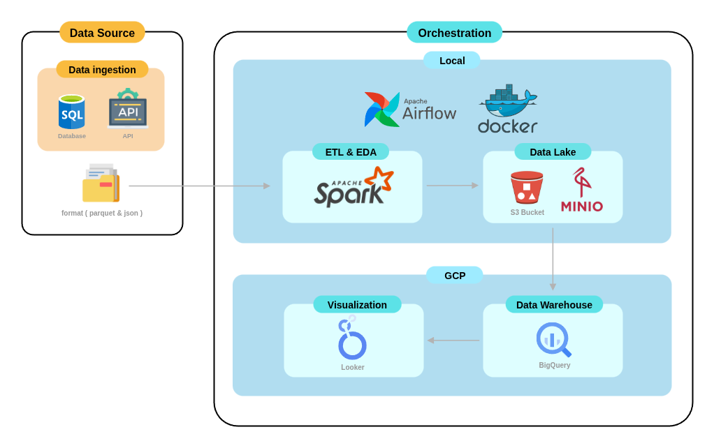
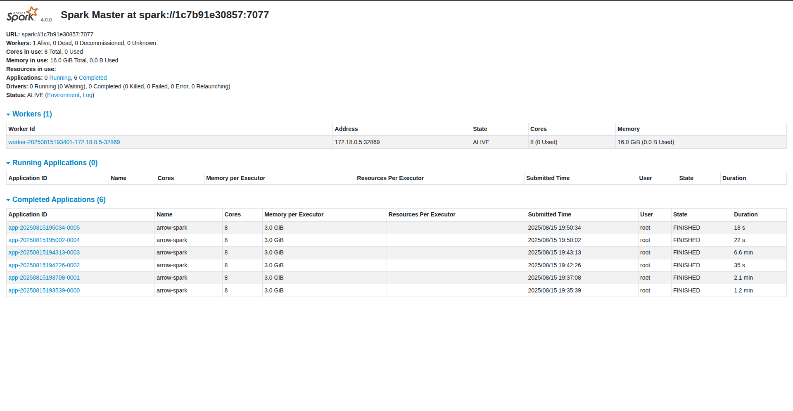
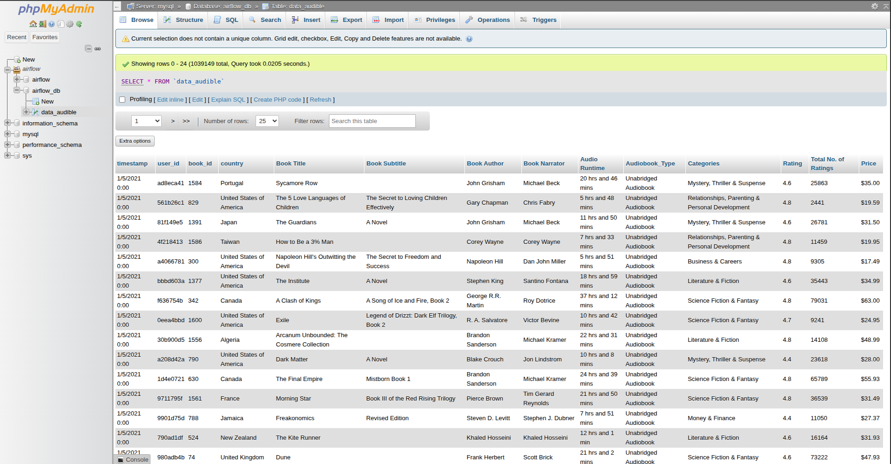

# 📘 Book Sales End-To-End Data Engineering Project

> End-to-end data engineering project using Docker, Airflow, Spark, MinIO(S3), BigQuery and Looker Studio

## 🧾 Project Overview

This project demonstrates a complete modern data pipeline from raw ingestion to BI dashboard.  
It covers orchestration (Airflow), distributed processing (Spark), cloud storage/warehouse (MinIO(S3) & BigQuery) and visualization (Looker Studio).

## ⚙️ Architecture Diagram


## 💡 Technology Stack

**Programming Languages :**
- Python
- SQL

**Data Processing & Orchestration :**
- Apache Airflow
- Apache Spark

**Infrastructure & Cloud Platform :**
- Docker
- MinIO (S3)
- BigQuery

**Visualization :**
- Looker Studio

## 🐳 Docker / Infrastructure Setup


**Services included :**
- `airflow-webserver`, `airflow-scheduler`
- `spark-master`, `spark-worker`
- `mysql`, `phpmyadmin`, `json-server`, etc.

## 💾 Data Lake Storage (MinIO)


**Bucket Structure :**
- Uses **MinIO** as an S3-compatible object storage.
- All raw, processed, and output data from the pipeline is stored here before being loaded into the data warehouse.
- The `data-lake` bucket is the primary storage location for this project.

## ⚡ Spark Cluster (Master/Workers)



**This cluster runs in standalone mode with :**
- 1 Spark Master
- 1 Spark Workers
- Deployed inside Docker containers

## 📂 Raw Database

### 1. MySQL Tables


- `data_audible` : raw book sales data (user_id, country, price, rating, etc.)
- Data too large to include in repo.
- Download: [Google Drive Link](https://drive.google.com/...)

### 2. API Source (JSON)
```json
[
  {"date": "2021-04-01", "conversion_rate": 31.194, "id": "dc1b"},
  {"date": "2021-04-02", "conversion_rate": 31.29,  "id": "ac7a"},
  {"date": "2021-04-03", "conversion_rate": 31.256, "id": "b741"},
  {"date": "2021-04-04", "conversion_rate": 31.244, "id": "eaa3"},
  ...
]
```

- Conversion rate data fetched from API.
- File is included in repo at (server/conversion_rate.json).

## 🧾 Data Flow Diagram


## 🔄 ETL Workflow Diagram


#### Spark ETL Components / Airflow Tasks

1. **Extract Stage:**
   - `extract_from_db` → extract data from database → save as parquet
   - `extract_from_api` → extract data from API → save as JSON

2. **Transform Stage:**
   - `db_clean_db` / `api_clean` → clean database & API data
   - `join_table` → join DB and API data
   - `handle_missing` / `final` → handle missing values and eda
   - `transform_data` → perform additional transformations / calculations

3. **Load Stage:**
   - `load_data` → push final tables to BigQuery

## ✅ Final Output
[](https://lookerstudio.google.com/reporting/5737527d-e089-47f5-80f1-2adda4ff3019)
* The final output from Looker Studio can be accessed via the following link: [View Dashboard](https://lookerstudio.google.com/reporting/5737527d-e089-47f5-80f1-2adda4ff3019). Note: The dashboard reads data from a static CSV file exported from BigQuery.

## 🚀 Setup & Execution

1. Clone this repository :

```bash
git clone https://github.com/supakunz/Book-Revenue-Pipeline.git
```

2. Navigate to the project folder and Set up the environment variables :

```
cd Book-Revenue-Pipeline
```
- Create a `.env` file in the root directory.

- Add the following variables to the .env file, replacing the placeholder values with your own:

```
# Airflow Configuration
AIRFLOW_UID=1000
_AIRFLOW_WWW_USER_USERNAME=airflow
_AIRFLOW_WWW_USER_PASSWORD=airflow123

# MySQL Database
MYSQL_ROOT_PASSWORD=rootpassword
MYSQL_DATABASE=airflow
MYSQL_USER=airflow
MYSQL_PASSWORD=airflow

# MinIO
MINIO_ROOT_USER=minioadmin
MINIO_ROOT_PASSWORD=minioadmin

# Jupyter
JUPYTER_TOKEN=
JUPYTER_PORT=8888

# Network
COMPOSE_PROJECT_NAME=data-engineering

# Additional Ports
PHPMYADMIN_PORT=8082
AIRFLOW_WEBSERVER_PORT=8080
SPARK_MASTER_UI_PORT=8081
MINIO_API_PORT=9000
MINIO_CONSOLE_PORT=9001
MYSQL_PORT=3306
```
3. Download the raw data from [Google Drive Link](https://drive.google.com/...) :

    - Extract or move the files into the initdb/ folder inside the project directory.

    - This data will be automatically loaded into the pipeline when the containers start.

4. Start the services :
```bash
docker compose up -d
```

## 🙋‍♂️ Contact

Developed by **Supakun Thata**  
📧 Email: supakunt.thata@gmail.com  
🔗 GitHub: [SupakunZ](https://github.com/SupakunZ)

